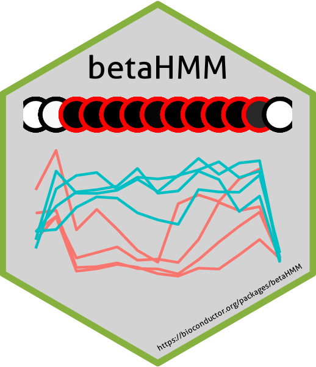

```{r setup, include = FALSE}

options(rmarkdown.html_vignette.check_title = FALSE)
knitr::opts_chunk$set(
    collapse = TRUE,
    comment = "#>"
)
knitr::opts_chunk$set(echo = TRUE)
knitr::opts_chunk$set(eval = TRUE)

#knitr::opts_chunk$set(dev = 'png')
#knitr::opts_chunk$set(dpi=100)
```


# Introduction

The addition of a methyl group from a cytosine-guanine dinucleotide (CpG) site,
known as DNA methylation, arises as a result of various environmental factors
and is an important biomarker for disease progression. In diploid individuals,
a CpG site is hypermethylated if both strands are methylated, hypomethylated if
neither of the strands is methylated, and hemimethylated if only a single strand
is methylated. Identifying differentially methylated CpG sites (DMC) and regions
(DMR) between samples, such as benign and tumour can help identify the effect of
environmental stressors on epigenetic changes.

Methylation levels at CpG sites, termed beta values, represents the proportion
of methylated probes. The beta values lie within [0,1] and are typically
modelled using beta distributions. Due to the lack of suitable, scalable methods
for the beta values, they are usually logit transformed into approximately
Gaussian-distributed M-values for modelling. Typically, adhoc thresholds are
selected to identify the methylation state of a CpG site, and based on this
classification, DMCs are identified between different samples. To instead
directly model the beta values, a family of beta mixture models (BMM) was
recently proposed but it inherently assumes spatial independence between
adjacent CpG sites. However in reality, a high level of spatial correlation
exists between neighbouring CpG sites. To model the untransformed beta values
while appropriately considering the spatial correlation between adjacent CpGs,
we propose here a homogeneous hidden Markov model (HMM) approach. The betaHMM
identifies DMCs and DMRs while simultaneously accounting for the spatial
dependency between adjacent CpG sites and the relationship between samples
within each group. A comprehensive simulation study and application on prostate
cancer data demonstrates that the betaHMM effectively models latent methylation
state changes while considering the genome-wide spatial dependency.

This document gives a quick tour of the functionalities in **betaHMM**. See
`help(package="betaHMM")` for further details and references provided by
`citation("betaHMM")`.

# Walk through

## Prerequisites
Before starting the **betaHMM** walk through, the user should have a working
R software environment installed on their machine. The **betaHMM** package has
the following dependencies which, if not already installed on the machine will
automatically be installed along with the package:
**stats, ggplot2,  scales, methods, pROC, foreach, doParallel, cowplot, dplyr,
tidyr, stringr**.


Assuming that the user has the **betaHMM** package installed,
the user first needs to load the package:

```{r package, include=TRUE, echo=TRUE, message=FALSE,warning=FALSE}
library(betaHMM)
```

## Loading the data


## Loading the methylation and annotation data
The **betaHMM** software package presents a prepared methylation dataframe that
encompasses beta values originating from DNA samples collected from four
patients afflicted with high-grade prostate cancer. These samples derive from
both benign and tumor prostate tissues and have undergone methylation profiling
using the Infinium MethylationEPIC Beadchip technology. The dataset consists of
DNA samples from R = 2 treatment conditions from each of N = 4 patients,
with each DNA sample containing beta
values corresponding to C = 694,820 CpG sites. This data collection was
conducted as part of a study on prostate cancer methylomics (Silva et al. 2020).

The methylation array data underwent rigorous quality control and preprocessing
through utilization of the RnBeads package (Mueller et al. 2019). Following
this, the data underwent normalization, with the exclusion of probes situated
outside of CpG sites and those on the sex chromosome. Furthermore, CpG sites
bearing missing values were eliminated from the resultant dataset. For testing
purposes, a subset of CpG sites from chromosome 7 has been provided in the
package.

A subset of the EPIC annotation file is also available in this package and needs
to be provided as an input to the betaHMM function.
Users can load these two data from the package and examine the initial six rows
present in the dataframes using the following procedure:

```{r data,include=TRUE, echo=TRUE}
data(pca_methylation_data)
head(pca_methylation_data)
data(annotation_data)
head(annotation_data)


```

## The betaHMM workflow

The betaHMM model for identifying DMCs and DMRs has three important functions.
The entire process is applied for each chromosome individually and has the
following steps:
\begin{itemize}
    \item the \textbf{betaHMM} function for model parameter and hidden state
    estimation. As discussed previously this function has 3 main steps:
    initialisation, Baum-Welch algorithm and Viterbi algorithm.
    \item The \textbf{DMC identification} function uses the betaHMM output and
    selects the differentially methylated hidden states and the DMCs.
    The area-under-curve (AUC) method is used to select the DMCs.
    \item The \textbf{DMR identification} function uses the DMC
    function output.The function also has a user-defined parameter of the
    minimum number of adjacent CpGs to be in a DMR. The output of this
    function is a dataframe containing the number of DMCs in a DMR,
    the CpG sites and the starting and ending location information of that DMR.
\end{itemize}

## Model parameter estimation

The first step of the workflow is to apply the Baum-Welch algorithm to estimate
the model parameters and subsequently apply the Viterbi algorithm to find the
most probable sequence of hidden states.

```{r betaHMM,include=TRUE, echo=TRUE}
M <- 3 ## No. of methylation states in a DNA sample type
N <- 4 ## No. of patients
R <- 2 ## No. of treatment conditions
my.seed <- 321 ## set seed for reproducibility

betaHMM_out <- betaHMM::betaHMM(pca_methylation_data,
                                annotation_data,
                                M = 3,
                                N = 4,
                                R = 2,
                                parallel_process = FALSE,
                                seed = my.seed,
                                treatment_group = c("Benign","Tumour"))
```

## Summary of model parameters
The resulting output of a call to betaHMM is an S4 object of class
betaHMMResults.
```{r betaHMMclass,include=TRUE, echo=TRUE}
class(betaHMM_out)
```

The parameters estimated can be displayed using the following S4 methods:

```{r betaHMMaccessor,include=TRUE, echo=TRUE}
## transition matrix estimated for all chromosomes
A(betaHMM_out)

## Shape parameters estimated for a certain chromosome
phi(betaHMM_out)

## Hidden states assigned to all CpG sites for a certain chromosome
head(hidden_states(betaHMM_out)[["chr 7"]])
```


A summary of the model parameters estimated for each chromosome can be obtained
as below:

```{r betaHMMsummary,include=TRUE, echo=TRUE}
summary(betaHMM_out)
```


## DMC identification

Once the parameters and the hidden states are estimated, The AUC metric is
calculated to find the dissimilarities between the cumulative ditsributions
estimated for each hidden state in each chromosome. A user-defined threshold for
the AUC metric is used to identify the most differentially methylated hidden
states and a user-defined threshold for the measure of uncertainty of belonging
to those most differentially methylated hidden states are used to identify the
most differentially methylated CpG sites.

The dataframe containing the CpG site location information and the methylation
values, the hidden states assignment and flag denoting a DMC or not can be
assessed through the S4 `assay` command.

```{r dmc,include=TRUE, echo=TRUE}
dmc_out <- dmc_identification(betaHMM_out)
dmc_df <- assay(dmc_out)
head(dmc_df)
```

## Summary of the DMCs identified

```{r dmcsummary,include=TRUE, echo=TRUE}
summary(dmc_out)
```

## Plot the density estimates of the model parameter estimates

The fitted density estimates, kernel density estimates and the uncertainty in
the hidden state assignment can be viewed using the plot function for the
betaHMM output. As the parameters are estimated for each chromosome
individually, the plot can be obtained for each chromosome.
The chromosome number needs to be selected using the `chromosome` parameter
in the function.

The AUC metrics calculated for the hidden states can also be displayed using
the parameter `AUC`. The AUC values estimated using the `dmc_identification`
function is passed as an input parameter to the function and the AUC metrics
corresponding to the selected chromosome is displayed in the plot panels.

```{r betaHMMplot,include=TRUE,echo=TRUE,fig.width=8,fig.height=5,dev='png'}
AUC_chr <- AUC(dmc_out)
plot(betaHMM_out, chromosome = "7", what = "fitted density", AUC = AUC_chr)
```

The visualization of uncertainties in hidden state estimation is achieved
through the utilization of a boxplot. Furthermore, users have the capability to
provide the threshold of uncertainty, intended for DMC identification, as an
input parameter to the plotting function. This facilitates the inclusion of the
specified threshold alongside the visualization of uncertainties.

```{r betaHMMplot2,include=TRUE,echo=TRUE,fig.width=6,fig.height=5,dev='png'}
plot(betaHMM_out, chromosome = "7", what = "uncertainty",
        uncertainty_threshold = 0.2)
```

## DMR identification from DMCs identified

The spatially correlated CpG sites result in a region of CpG sites having
similar methylation states thus resulting in forming of biologically
significant regions known as the differentially methylated region (DMR). A
user-defined parameter `DMC_count` is used define the number of adjacent DMCs
in a DMR. By default the value is set to 2. If no value is provided,
the function identifies regions with adjacent 2 or more DMCs in a chromosome
as a DMR. The DMR location information along with the DMCs in that DMR are
provided as an S4 output of class `dmrResults`. The output can be accessed
using the S4 assay method.

```{r dmr,include=TRUE, echo=TRUE}
dmr_out <- dmr_identification(dmc_out, parallel_process = FALSE)
dmr_df <- assay(dmr_out)
head(dmr_df)
```

## Summary of the DMRs identified

```{r dmrsummary,include=TRUE, echo=TRUE}
summary(dmr_out)
```


## Plot to visualise the DMCs and DMRs

The S4 plot method can use the output from the `dmc_identification` function
and plot the methylation values and the uncertainty in being identified as a
DMC. The starting CpG site IlmnID needs to be provided as an input to the plot
function. The parameter `end_CpG` can either have the IlmnID of the ending CpG
site to be plotted or the number of CpG sites to be plotted excluding the
starting CpG site.

We can see that the CpG site has a very low uncertainty of belonging to the
hidden state identified as the most differentially methylated state but as it
was below the threshold value used by the user, it was not selected as
a DMC.

```{r dmrplot,include=TRUE,echo=TRUE,fig.width=7,fig.height = 5, dev = 'png'}
p<-plot(dmc_out, start_CpG = "cg17750844", end_CpG = 15)
```

## Threshold identification in DNA samples from a treatment condition

The initialization of the complex \eqn{K} hidden states betaHMM model for
identifying hidden states that are differentially methylated between DNA samples
collected from multiple biological conditions uses a simple 3 state betaHMM
model for parameter estimation of a single treatment condition. These
estimated parameters are then combined to form the \eqn{3^R} hidden states
parameter model. The function used for estimating the 3 state betaHMM also
objectively estimates the threshold methylation value between the 3 methylation
states (hypomethylation, hemimethylation and hyprmethylation). This function can
be executed individually to analyse the data distribution in DNA samples from
a single biological condition.

```{r threshold,include=TRUE, echo=TRUE}
threshold_out <- threshold_identification(pca_methylation_data[,1:5],
                                            package_workflow = FALSE,
                                            annotation_file = annotation_data,
                                            M = 3,
                                            N = 4,
                                            parameter_estimation_only = FALSE,
                                            seed = my.seed)
threshold(threshold_out)
```

## Plotting the results from threshold identification function

```{r thresholdplot,include=TRUE,echo=TRUE,fig.width=5,fig.height=4,dev='png'}
plot(threshold_out, what = "fitted density")
```

```{r}
sessionInfo()
```
